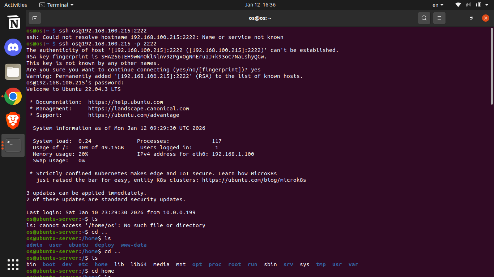
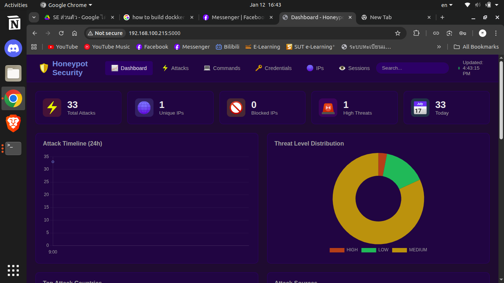

# รายงานโครงงานรายวิชา ENG23 3054 ระบบปฏิบัติการ
**หัวข้อโครงงาน (ภาษาไทย):** กับดักล่อแฮกเกอร์
**หัวข้อโครงงาน (ภาษาอังกฤษ):** Honeypot

---

## ข้อมูลเบื้องต้น

| รายละเอียด | ข้อมูล |
| :--- | :--- |
| **รายวิชา** | ENG23 3054 ระบบปฏิบัติการ (Operating Systems) |
| **กลุ่มที่** | 9 |
| **กลุ่มเรียนที่** | 1 |
| **สาขาวิชา** | วิศวกรรมคอมพิวเตอร์ สำนักวิชาวิศวกรรมศาสตร์ |
| **สถาบัน** | มหาวิทยาลัยเทคโนโลยีสุรนารี |
| **ปีการศึกษา** | 2569 |

### คณะผู้จัดทำ

| ลำดับ | ชื่อ - สกุล | รหัสนักศึกษา | หน้าที่รับผิดชอบ |
| :---: | :--- | :--- | :--- |
| 1 | นายภูผา บุญเทียม | B6607845 | Backend |
| 2 | นายภาวิฒ ฉ่ำเสนาะ | B6617646 | Frontend + Doc |
| 3 | นายสรายุทธ อินทร์โสภา | B6618599 | Frontend |
| 4 | นายตะวัน นามโสม | B6627416 | Backend + Deploy |

---

## สารบัญ
1. [บทคัดย่อ (Abstract)](#บทคัดย่อ)
2. [วัตถุประสงค์ (Objectives)](#1-วัตถุประสงค์)
3. [ทฤษฎีที่เกี่ยวข้อง (Related Theories)](#2-ทฤษฎีที่เกี่ยวข้อง)
4. [การออกแบบ (System Design)](#3-การออกแบบ)
5. [ผลการดำเนินงาน (Results)](#4-ผลการดำเนินงาน)
6. [สรุปผลและข้อเสนอแนะ (Conclusion)](#5-สรุปผลการดำเนินงานและข้อเสนอแนะ)
7. [เอกสารอ้างอิง (References)](#เอกสารอ้างอิง)

---

## บทคัดย่อ
ระบบความปลอดภัยในปัจจุบันส่วนใหญ่มักมุ่งเน้นการป้องกันเชิงรับ (Reactive Security) คือรอให้เกิดเหตุการณ์โจมตีก่อนจึงทำการตรวจจับและแก้ไขปัญหา ซึ่งส่งผลให้ระบบยังคงเสียเปรียบผู้โจมตีอยู่เสมอ โครงงานนี้จึงนำเสนอแนวคิดการรักษาความปลอดภัยเชิงรุก (Proactive Security) โดยพัฒนาระบบ Honeypot บนแพลตฟอร์ม Raspberry Pi 3 เพื่อทำหน้าที่เป็นระบบจำลองหรือ “ตัวล่อ” สำหรับดึงดูดผู้โจมตีให้เข้ามาโจมตีแทนระบบจริง

Raspberry Pi 3 ถูกเลือกใช้เป็นแกนหลักของระบบ เนื่องจากมีขนาดเล็ก ใช้พลังงานต่ำ ต้นทุนต่ำ และสามารถทำงานเป็นอุปกรณ์เครือข่ายได้อย่างมีประสิทธิภาพ เหมาะสำหรับการติดตั้งในสภาพแวดล้อมจริง ระบบ Honeypot ที่พัฒนาขึ้นสามารถดักจับและบันทึกพฤติกรรมการโจมตีผ่าน SSH Protocol และ Web Application ได้อย่างละเอียด พร้อมทั้งวิเคราะห์รูปแบบและประเมินระดับความอันตรายของพฤติกรรมผู้โจมตี

ข้อมูลที่ได้จากการโจมตีจะถูกนำไปใช้เพื่อศึกษาพฤติกรรมของผู้ไม่หวังดีล่วงหน้า ช่วยเพิ่มความเข้าใจเกี่ยวกับเทคนิคการโจมตี และสามารถนำไปประยุกต์ใช้ในการปรับปรุงระบบรักษาความปลอดภัยของระบบจริงให้มีประสิทธิภาพมากยิ่งขึ้น

---

## 1. วัตถุประสงค์
1. เพื่อพัฒนาระบบสำหรับบันทึกการตรวจจับและโจมตีผ่าน SSH Protocol
2. เพื่อศึกษาและวิเคราะห์พฤติกรรมของผู้โจมตี
3. เพื่อลดความเสี่ยงต่อระบบจริง

## 2. ทฤษฎีที่เกี่ยวข้อง

### 2.1 Honeypot
Honeypot คือระบบคอมพิวเตอร์ที่ถูกตั้งขึ้นเพื่อเป็น "เป้าหลอก" ดึงดูดผู้โจมตี ทำให้สามารถเฝ้าสังเกตและวิเคราะห์วิธีการโจมตีได้ทุกขั้นตอน โดยที่ไม่ต้องเสี่ยงกับระบบจริง

### 2.2 SSH Protocol
SSH (Secure Shell) เป็นโปรโตคอลที่ใช้สำหรับการเชื่อมต่อและควบคุมเครื่องเซิร์ฟเวอร์จากระยะไกลอย่างปลอดภัย ซึ่งเป็นช่องทางที่ผู้โจมตีมักใช้ในการพยายามเจาะระบบ

### 2.3 Threat Detection and Analysis
การตรวจจับและวิเคราะห์ภัยคุกคาม เป็นกระบวนการในการระบุและประเมินระดับความอันตรายของพฤติกรรมที่น่าสงสัยในระบบ

## 3. การออกแบบ

**แผนภาพกระบวนการทำงาน (System Flowchart)**

*(คำอธิบาย: แผนภาพแสดงลำดับการทำงานของระบบ Honeypot ตั้งแต่การรับ connection จากผู้โจมตี การบันทึก log ไปจนถึงการวิเคราะห์และแสดงผล)*

## 4. ผลการดำเนินงาน

### ผลลัพธ์ที่ 1: ดักจับพฤติกรรม Hacker ผ่าน SSH Protocol
พัฒนา Software Program ที่สามารถดักจับพฤติกรรมของ Hacker ผ่าน SSH Protocol ได้สำเร็จ

### ผลลัพธ์ที่ 2: ดักจับพฤติกรรม Hacker ผ่าน Web Application
พัฒนา Software Program ที่สามารถดักจับพฤติกรรมของ Hacker ผ่าน Web Application ได้สำเร็จ

### ผลลัพธ์ที่ 3: หน้ารายงานพฤติกรรม Hacker
พัฒนาหน้ารายงานพฤติกรรมของ Hacker ที่สามารถแสดงระดับความอันตรายของพฤติกรรมที่ตรวจพบได้

## 5. สรุปผลการดำเนินงานและข้อเสนอแนะ

### 5.1 สรุปผลการดำเนินงาน
* พัฒนาระบบ Honeypot ที่สามารถดักจับและบันทึกพฤติกรรมผู้โจมตีผ่าน SSH Protocol ได้สำเร็จ
* สามารถวิเคราะห์และแสดงระดับความอันตรายของพฤติกรรมผู้โจมตีได้

### 5.2 ปัญหาและข้อเสนอแนะ
* **ปัญหาที่พบ:** ในขั้นตอนการพัฒนา ทีมงานมีแนวคิดที่จะนำเทคโนโลยี Machine Learning มาใช้ในการวิเคราะห์และจำแนกรูปแบบการโจมตีโดยอัตโนมัติ เพื่อเพิ่มความแม่นยำในการตรวจจับภัยคุกคาม อย่างไรก็ตาม Raspberry Pi 3 มีข้อจำกัดด้านทรัพยากร ทั้ง CPU (1.2GHz), RAM (1GB) และ Storage ทำให้ไม่สามารถรองรับการประมวลผล ML Model ที่ต้องใช้ทรัพยากรสูงได้อย่างมีประสิทธิภาพ
* **ข้อเสนอแนะ:**
    * อัปเกรดไปใช้ Raspberry Pi 4 หรือ Raspberry Pi 5 ที่มี RAM และ CPU สูงขึ้น
    * ใช้ Lightweight ML Model เช่น TensorFlow Lite หรือ Edge AI ที่ออกแบบมาสำหรับอุปกรณ์ที่มีทรัพยากรจำกัด
    * แยกส่วนการประมวลผล ML ไปทำบน Cloud Server แล้วส่งเฉพาะ Log ไปวิเคราะห์

---

## เอกสารอ้างอิง

1. Sochor, T., & Zuzcak, M. (2023). *Analysis of SSH Honeypot Effectiveness*. Springer Link. สืบค้นจาก https://link.springer.com/chapter/10.1007/978-3-031-28073-3_51

2. Setiawan, A. B., & Darmawan, A. (2024). *Development of a Cowrie Honeypot System on Raspberry Pi for Monitoring SSH Attacks and Analyzing Attacker Behavior*. Figshare. สืบค้นจาก https://figshare.com/articles/preprint/Development_of_a_Cowrie_Honeypot_System_on_Raspberry_Pi_for_Monitoring_SSH_Attacks_and_Analyzing_Attacker_Behavior/30598364

3. Paliwal, S. (2023). *Honey-Pi: A Honeypot installed on Raspberry-Pi*. Journal of Emerging Technologies and Innovative Research (JETIR). สืบค้นจาก https://www.jetir.org/papers/JETIR2304C48.pdf

4. Vetterl, A., & Clayton, R. (2018). *Bitter Harvest: Systematically Fingerprinting Low- and Medium-interaction Honeypots at Internet Scale*. 12th USENIX Workshop on Offensive Technologies (WOOT 18).

5. Shiota, M., & Zou, C. C. (2024). *WiP: Developing High-interaction Honeypots to Capture and Analyze Region-Specific Bot Behaviors*. HoTSoS 2024, Johns Hopkins University. สืบค้นจาก https://isi.jhu.edu/wp-content/uploads/2024/02/Honeypot_Paper_for_HoTSoS-2024-2.pdf

6. Cowrie Documentation. (2024). *Cowrie SSH and Telnet Honeypot*. GitHub. สืบค้นจาก https://github.com/cowrie/cowrie
